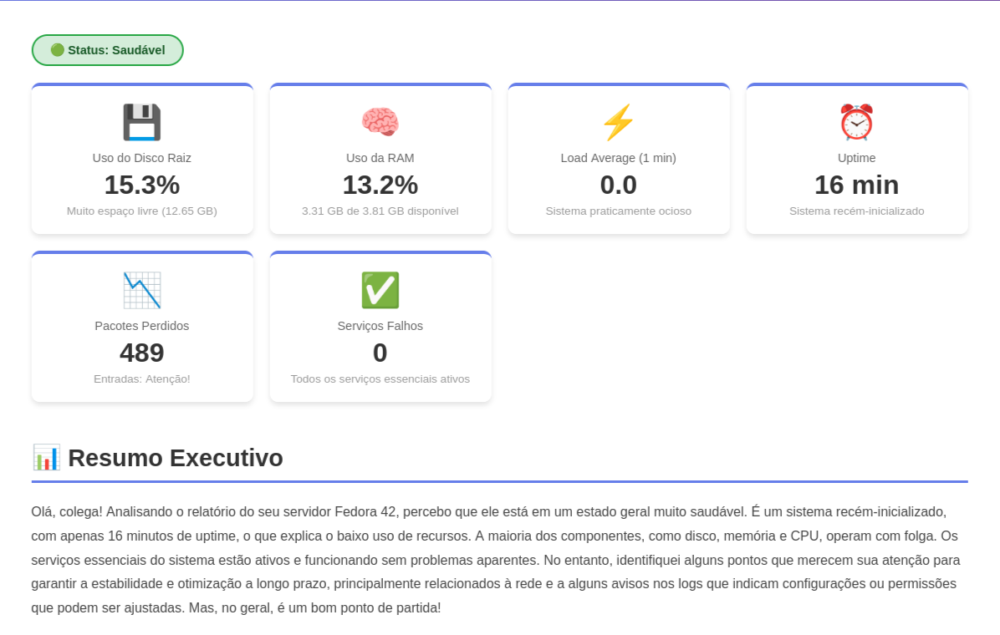
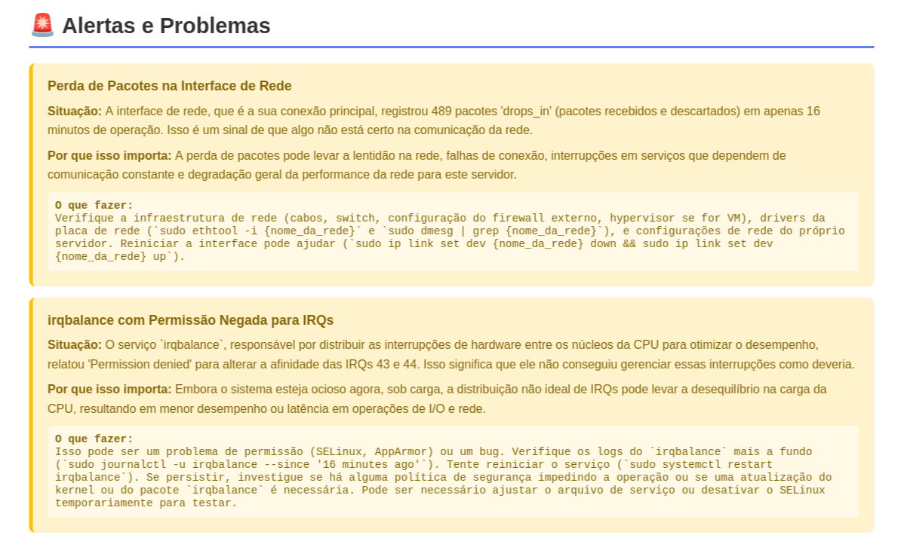
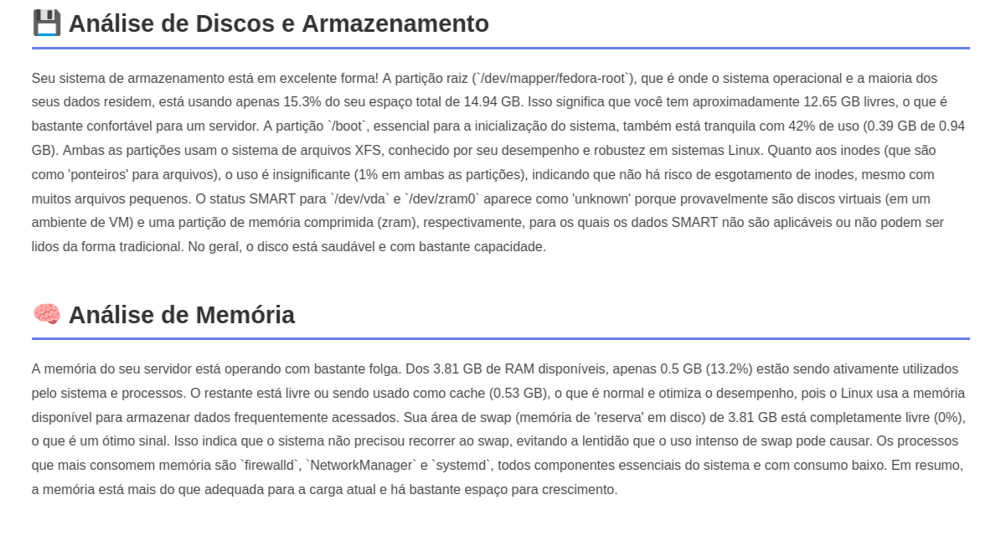
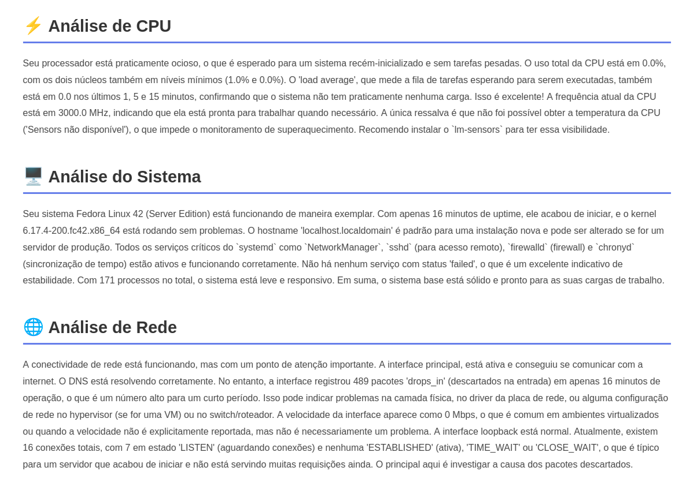
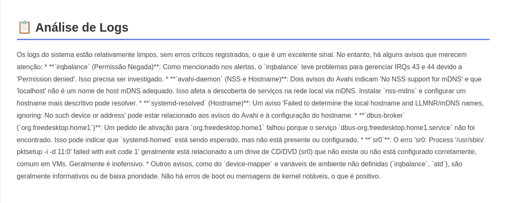
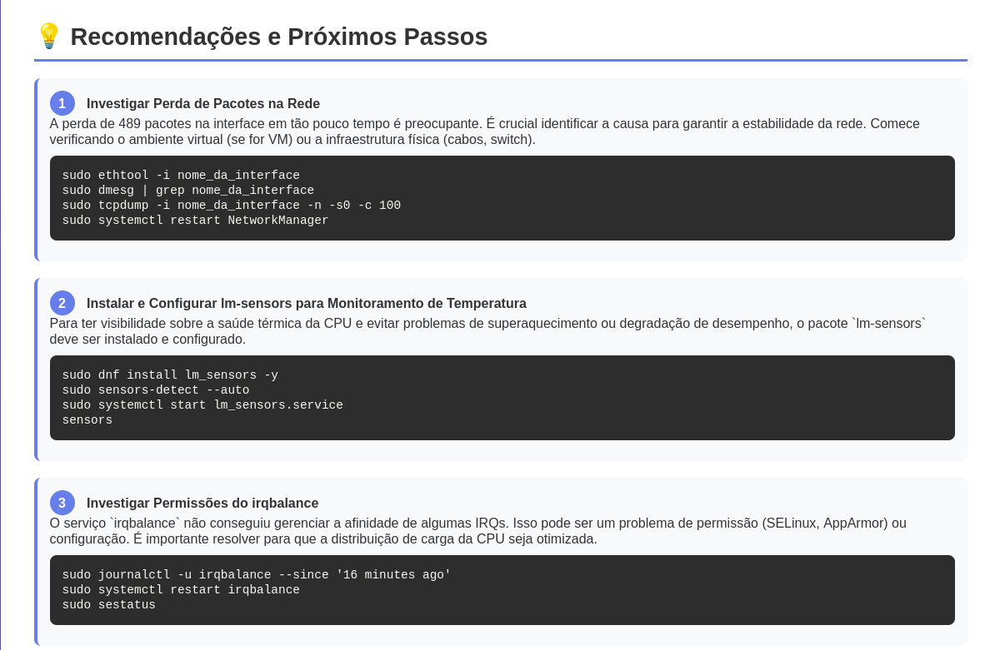
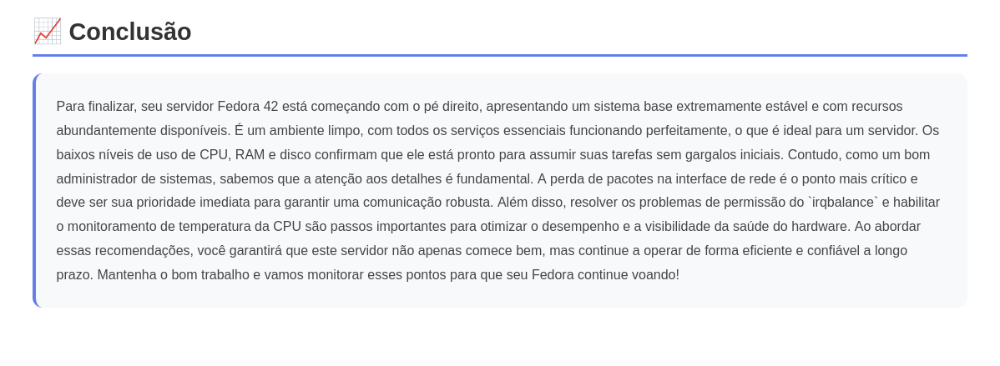

<div align="center">

# 🔥 Monitor Linux IA 🔥

### Sistema Inteligente de Monitoramento de Saúde para Linux


<a href="LICENSE"></a>

**Monitoramento Inteligente em Tempo Real**  
Coleta automática de métricas + Análise por IA = Relatórios humanizados e acionáveis

</div>

---

## 📋 Índice

- [Sobre o Projeto](#-sobre-o-projeto)
- [Características](#-características)
- [Arquitetura](#-arquitetura)
- [Instalação](#-instalação)
- [Uso](#-uso)
- [Exemplos de Saída](#-exemplos-de-saída)
- [Estrutura do Projeto](#-estrutura-do-projeto)
- [Contribuindo](#-contribuindo)

---

## 🎯 Sobre o Projeto

O **Monitor Linux IA** é uma solução completa de monitoramento de sistemas Linux que combina coleta de métricas em tempo real com análise inteligente usando **Google Gemini 2.5 Flash**. 

### Componentes Principais

| Componente | Descrição | Tecnologia | Output |
|------------|-----------|------------|--------|
| **⚙️ Health Monitor** | Coleta métricas detalhadas do sistema (CPU, Memória, Disco, Rede, Logs, Processos) | Python + psutil | JSON estruturado |
| **🤖 IA Report** | Analisa dados com IA e gera alertas, recomendações, insights e soluções | Python + Gemini API | HTML interativo |

---

## ✨ Características

<details open>
<summary><b>🔍 Monitoramento Abrangente</b></summary>

- ✅ **CPU**: Uso, frequências, processos top, temperatura
- ✅ **Memória**: RAM, Swap, cache, buffers
- ✅ **Disco**: Uso por partição, I/O, filesystems
- ✅ **Rede**: Interfaces, tráfego, conexões ativas
- ✅ **Sistema**: Uptime, carga, usuários, serviços
- ✅ **Logs**: Análise de journalctl com detecção de padrões
</details>

<details open>
<summary><b>🧠 Análise Inteligente com IA</b></summary>

- 🤖 Interpretação contextual das métricas
- 📊 Identificação automática de anomalias
- 🎯 Recomendações específicas e acionáveis
- 💡 Soluções práticas com comandos prontos
- 📈 Análise de tendências e previsões
</details>

<details open>
<summary><b>📄 Relatórios Visuais</b></summary>

- 🎨 HTML responsivo com gradientes e animações
- 📱 Design moderno e profissional
- 🔴🟡🟢 Sistema de alertas por cores
- 📊 Cards e gráficos visuais
</details>

---

## 🏗️ Arquitetura


**Pipeline de Execução:**

```
run.sh → Health Monitor (Python) → health_YYYYMMDD_HHMMSS.json → IA Report (Gemini) → health_YYYYMMDD_HHMMSS_report_YYYYMMDD_HHMMSS.html
```

---

## 🚀 Instalação

### Pré-requisitos

- Python 3.8+
- Linux (testado em Fedora Workstation)
- Chave de API do Google Gemini ([obtenha aqui](https://aistudio.google.com/app/apikey))

### Passo 1: Clone o Repositório

```bash
git clone https://github.com/montezuma-p/monitor_linux_ia.git
cd monitor_linux_ia
```

### Passo 2: Configure o Health Monitor

```bash
cd health_monitor
python3 -m venv venv
source venv/bin/activate
pip install -r requirements.txt
deactivate
cd ..
```

### Passo 3: Configure o IA Report

```bash
cd iareport
python3 -m venv venv
source venv/bin/activate
pip install -r requirements.txt
deactivate
cd ..
```

### Passo 4: Configure a Chave da API

```bash
export GEMINI_API_KEY='sua_chave_aqui'

# Para tornar permanente, adicione ao ~/.bashrc:
echo "export GEMINI_API_KEY='sua_chave_aqui'" >> ~/.bashrc
```

### Passo 5: Ajuste Permissões

```bash
chmod +x run.sh
```

---

## 💻 Uso

### Execução Completa (Recomendado)

Execute o pipeline completo com um único comando:

```bash
./run.sh
```

Isso irá:
1. 📊 Coletar todas as métricas do sistema
2. 💾 Salvar JSON em `exemplosdesaida/saidasraw/`
3. 🤖 Analisar com IA
4. 🌐 Gerar relatório HTML em `exemplosdesaida/saidascomia/`

### Execução Manual

#### Health Monitor (Coleta)

```bash
cd health_monitor
source venv/bin/activate
python3 health_monitor.py
deactivate
```

#### IA Report (Análise)

```bash
cd iareport
source venv/bin/activate
python3 reportia.py
deactivate
```

---

## 🎨 Exemplos de Saída

Veja abaixo exemplos reais de relatórios gerados pelo sistema:

---

### 📊 Resumo Inicial

O relatório começa com uma visão geral do status do sistema, destacando métricas principais e o estado de saúde geral.



---

### 🚨 Alertas Inteligentes

A IA identifica automaticamente problemas e anomalias, priorizando-os por severidade (Crítico, Atenção, Info).



---

### 💾 Discos e Memória

Análise detalhada do uso de discos e memória, com indicadores visuais de utilização e recomendações.



---

### ⚙️ CPU, Sistema e Rede

Métricas de processamento, carga do sistema, temperatura e estatísticas de rede em tempo real.



---

### 📝 Análise de Logs

A IA analisa os logs do sistema (journalctl) e identifica padrões, erros e avisos importantes.



---

### 💡 Recomendações Inteligentes

Sugestões práticas e acionáveis geradas pela IA, com comandos prontos para executar.



---

### ✅ Conclusão

Resumo final com avaliação geral da saúde do sistema e próximos passos recomendados.



---

## 📁 Estrutura do Projeto

```
monitor_linux_ia/
├── 📜 run.sh                          # Script orquestrador principal
├── 📂 health_monitor/                 # Módulo de coleta de métricas
│   ├── health_monitor.py             # Script principal
│   ├── config.json                   # Configurações e thresholds
│   ├── requirements.txt              # Dependências Python
│   ├── documentacao_tecnica.md       # Documentação técnica
│   └── modules/                      # Módulos de coleta
│       ├── __init__.py
│       ├── alerts.py                 # Sistema de alertas
│       ├── cpu.py                    # Métricas de CPU
│       ├── disk.py                   # Métricas de disco
│       ├── memory.py                 # Métricas de memória
│       ├── network.py                # Métricas de rede
│       ├── system.py                 # Informações do sistema
│       └── logs.py                   # Análise de logs
│
├── 📂 iareport/                       # Módulo de análise com IA
│   ├── reportia.py                   # Gerador de relatórios
│   ├── template.html                 # Template HTML base
│   ├── requirements.txt              # Dependências Python
│   └── documentacao_tecnica.md       # Documentação técnica
│
├── 📂 exemplosdesaida/                # Exemplos de saída
│   ├── saidasraw/                    # JSONs coletados
│   │   └── health_YYYYMMDD_HHMMSS.json
│   └── saidascomia/                  # Relatórios HTML
│       └── health_*_report_*.html
│
└── 📂 docs/                           # Documentação
    └── screenshots/                  # Screenshots dos relatórios
        ├── Resumo_inicio.png
        ├── Alertas.png
        ├── Discos_memoria.png
        ├── cpu_sistema_rede.png
        ├── logs.png
        ├── recomendações.png
        └── conclusao.png
```

---

## 🔧 Configuração Avançada

### Arquivo `health_monitor/config.json`

Personalize os thresholds de alertas:

```json
{
  "output_dir": "../exemplosdesaida/saidasraw",
  "thresholds": {
    "cpu_critical": 90,
    "cpu_warning": 70,
    "memory_critical": 90,
    "memory_warning": 80,
    "disk_critical": 90,
    "disk_warning": 80,
    "swap_warning": 50
  },
  "monitoring": {
    "log_lines": 100,
    "top_processes": 10,
    "network_interfaces": "all"
  }
}
```

---

## 🎓 Como Funciona

### 1️⃣ **Coleta de Métricas** (Health Monitor)

O `health_monitor.py` executa módulos especializados que coletam:
- Informações de CPU via `psutil` e `/proc`
- Métricas de memória e swap
- Status de discos e partições
- Estatísticas de rede
- Logs do sistema via `journalctl`
- Processos e serviços ativos

**Saída**: JSON estruturado com timestamp e todas as métricas

### 2️⃣ **Análise Inteligente** (IA Report)

O `reportia.py`:
1. Lê o JSON mais recente
2. Constrói um prompt detalhado para o Gemini
3. Solicita análise contextual e recomendações
4. Recebe resposta em JSON estruturado
5. Injeta os dados no template HTML
6. Gera relatório visual interativo

**Saída**: HTML com gradientes, cards, alertas coloridos e recomendações

---

## 🤝 Contribuindo

Contribuições são bem-vindas! Sinta-se livre para:

1. 🍴 Fork o projeto
2. 🌿 Criar uma branch (`git checkout -b feature/MinhaFeature`)
3. ✅ Commit suas mudanças (`git commit -m 'Adiciona MinhaFeature'`)
4. 📤 Push para a branch (`git push origin feature/MinhaFeature`)
5. 🔀 Abrir um Pull Request

---

## 📝 Licença

Este projeto está sob a licença MIT. Veja o arquivo [LICENSE](LICENSE) para mais detalhes.

---

<div align="center">

## 🌟 Desenvolvido por Montezuma 🌟

💻 Monitoramento Inteligente • 🤖 Powered by AI • 🚀 Open Source

Se este projeto foi útil, considere dar uma ⭐ no GitHub!

</div>

---

<div align="center">
<sub>Built with ❤️ using Python, Google Gemini AI, and lots of ☕</sub>
</div>
